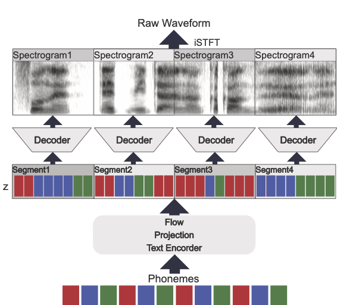
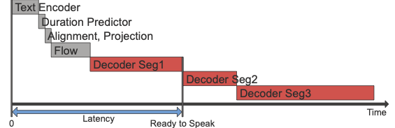

# Low-Latency End-to-End TTS with Partial Decoding (MB-iSTFT-VITS)

This project implements a low-latency end-to-end text-to-speech (TTS) system based on the  thesis: **"Research on Low-Latency End-to-End Text-to-Speech for Voice Dialogue Systems" (音声対話システム向け低遅延 End-to-end テキスト音声合成に関する研究)**.

The core contribution is the **"Partial Decoding" (部分的デコード)** method applied to iSTFT-VITS. By segmenting the latent representation `z` into smaller units (such as *bunsetsu* or phrases) and decoding them sequentially, we significantly reduce the time-to-first-audio (latency).

### Key Features
- **Latency Reduction**: Successfully reduced inference latency from approximately **123ms** to **46ms** (approx. 45% reduction).
- **Seamless Stitching**: Employs overlap-add, cross-correlation for phase alignment, and cross-fading to maintain high audio quality without click noise at segment boundaries.
- **Architecture**: Based on MB-iSTFT-VITS, which combines the efficiency of multi-band generation and inverse short-time Fourier transform.

### Visuals
#### Inference Behavior with Partial Decoding



#### Latency Illustration



---

### Masaya Kawamura, Yuma Shirahata, Ryuichi Yamamoto, Kentaro Tachibana
(Original MB-iSTFT-VITS authors)
We propose a lightweight end-to-end text-to-speech model using multi-band generation and inverse short-time Fourier transform. Our model is based on VITS, a high-quality end-to-end text-to-speech model, but adopts two changes for more efficient inference: 1) the most computationally expensive component is partially replaced with a simple inverse short-time Fourier transform, and 2) multi-band generation, with fixed or trainable synthesis filters, is used to generate waveforms. Unlike conventional lightweight models, which employ optimization or knowledge distillation separately to train two cascaded components, our method enjoys the full benefits of end-to-end optimization. Experimental results show that our model synthesized speech as natural as that synthesized by VITS, while achieving a real-time factor of 0.066 on an Intel Core i7 CPU, 4.1 times faster than VITS. Moreover, a smaller version of the model significantly outperformed a lightweight baseline model with respect to both naturalness and inference speed. Code and audio samples are available from [https://github.com/MasayaKawamura/MB-iSTFT-VITS](https://github.com/MasayaKawamura/MB-iSTFT-VITS).

You can check the [paper](https://arxiv.org/abs/2210.15975) and [demo page](https://masayakawamura.github.io/Demo_MB-iSTFT-VITS/).


## Multi-band iSTFT VITS and multi-stream iSTFT VITS 
This repository is based on **[official VITS code](https://github.com/jaywalnut310/vits.git)**.<br>
You can train the iSTFT-VITS, multi-band iSTFT VITS (MB-iSTFT-VITS), and multi-stream iSTFT VITS (MS-iSTFT-VITS) using this repository.<br>
We also provide the [pretrained models](https://drive.google.com/drive/folders/1CKSRFUHMsnOl0jxxJVCeMzyYjaM98aI2?usp=sharing).
### 1. Pre-requisites

0. Python >= 3.8
0. Clone this repository
0. Install python requirements. Please refer [requirements.txt](requirements.txt)
    1. You may need to install espeak first: `apt-get install espeak`
    2. For Japanese text processing, install MeCab and UniDic:
       ```sh
       pip install mecab-python3 unidic-lite
       # or if you want to use unidic:
       # pip install mecab-python3 unidic
       # python -m unidic download
       ```
0. Download datasets
    1. Download and extract the [LJ Speech dataset](https://keithito.com/LJ-Speech-Dataset/), then rename or create a link to the dataset folder: `ln -s /path/to/LJSpeech-1.1/wavs DUMMY1`
0. Build Monotonic Alignment Search and run preprocessing if you use your own datasets.
```sh
# Cython-version Monotonoic Alignment Search
cd monotonic_align
python setup.py build_ext --inplace
```

### 2. Setting json file in [configs](configs)

| Model | How to set up json file in [configs](configs) | Sample of json file configuration|
| :---: | :---: | :---: |
| iSTFT-VITS | ```"istft_vits": true, ```<br>``` "upsample_rates": [8,8], ``` | ljs_istft_vits.json |
| MB-iSTFT-VITS | ```"subbands": 4,```<br>```"mb_istft_vits": true, ```<br>``` "upsample_rates": [4,4], ``` | ljs_mb_istft_vits.json |
| MS-iSTFT-VITS | ```"subbands": 4,```<br>```"ms_istft_vits": true, ```<br>``` "upsample_rates": [4,4], ``` | ljs_ms_istft_vits.json |

### 3. Training
To start training, use `train_latest_fixed.py` (optimized for multi-GPU training):
```sh
# For MB-iSTFT-VITS
python train_latest_fixed.py -c configs/ljs_mb_istft_vits.json -m ljs_mb_istft_vits

# For Multi-speaker (e.g., CSJ/UUDB)
python train_latest_fixed.py -c configs/csj_ms_istft_vits_ms.json -m csj_ms_istft_vits_ms
```

### 4. Inference with SynthesisModule
You can use `synthesis_module.py` for easy inference. It provides a simple class-based interface to load a trained model and synthesize Japanese speech using **Partial Decoding**.

#### Streaming Inference (Recommended for Low Latency)
This method is especially effective in **CPU environments**. By decoding the latent representation in segments (e.g., *bunsetsu*), the system can start playing the first part of the audio while the rest is still being generated.

```python
from synthesis_module import SynthesisModule
import scipy.io.wavfile as wavfile

# Initialize module
module = SynthesisModule(config_path="configs/config.json", checkpoint_path="logs/model.pth")

# Streaming synthesis (yields chunks sequentially)
text = "こんにちは、逐次出力のテストです。"
for i, chunk in enumerate(module.synthesize_streaming(text, speaker_id=0)):
    # process or play each chunk (np.ndarray)
    print(f"Received chunk {i}, length: {len(chunk)}")
```

#### Comparison of Decoding Methods
The module supports several "Conditions" for research and optimization:

- **Streaming (`synthesize_streaming`)**: Based on Cond 3, but yields audio as it becomes ready. Best for real-time applications.
- **Cond 3 (`synthesize_cond3_shared`)**: Partial decoding with overlap-add and time-delay correction. High quality and low latency.
- **Cond 2 (`synthesize_cond2_shared`)**: Partial decoding by concatenating spectrograms before iSTFT.
- **Cond 4 (`synthesize_cond4_shared`)**: Full decoding of the entire sentence at once (Topline quality, but highest latency).

In CPU-bound environments, the "Time to First Audio" (latency) is significantly improved using the streaming/partial decoding approach compared to full decoding.

Alternatively, you can check [inference.ipynb](inference.ipynb) for interactive usage.

## References
- https://github.com/jaywalnut310/vits.git
- https://github.com/rishikksh20/iSTFTNet-pytorch.git
- https://github.com/rishikksh20/melgan.git
